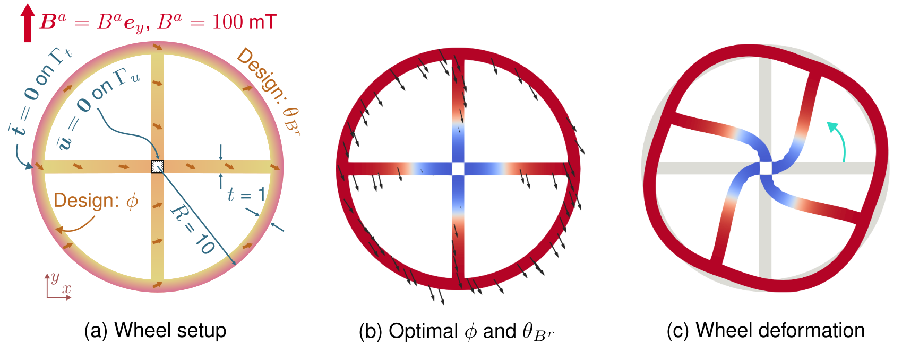
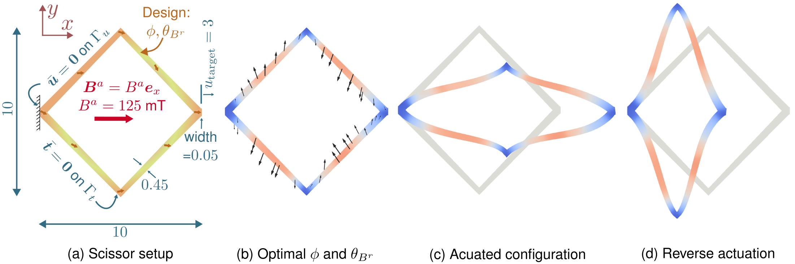
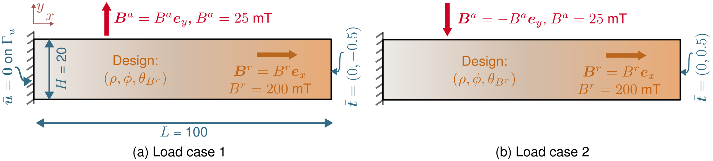
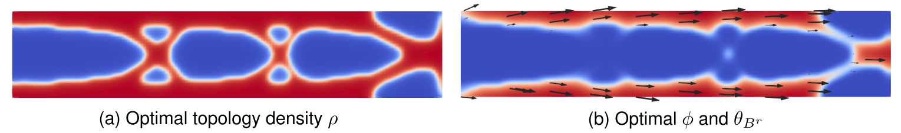
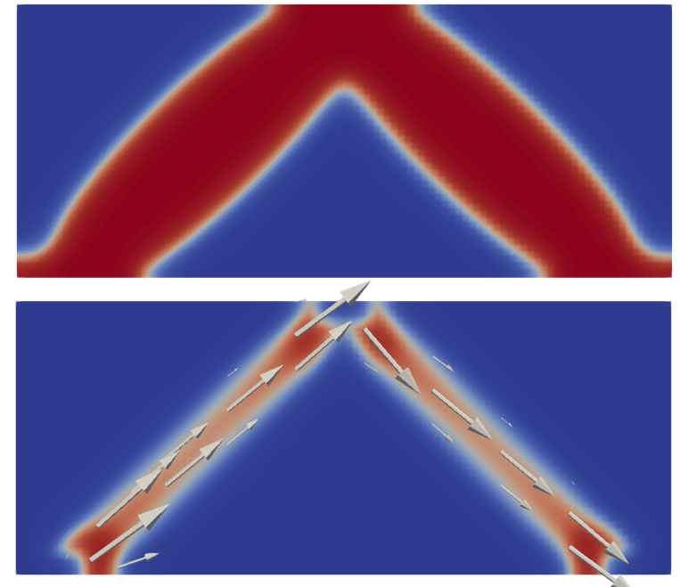
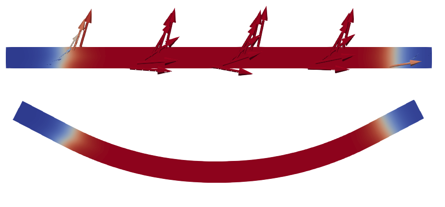

# MatTO

**Material and topology optimization of stimulus-responsive soft materials**

MatTO is a research framework for finite-element analysis and gradient-based optimization of structures whose mechanical response changes under an applied stimulus. Built with [FEniCSx](https://fenicsproject.org/) and extended from [FEniTop](https://github.com/missionlab/fenitop), the framework separates the optimization machinery from the constitutive model so that different stimulus-responsive material families can use the same nonlinear finite-element, adjoint-sensitivity, filtering, and MMA workflow.

The repository began as a framework for the joint material–structural optimization of hard-magnetic soft materials (hMSMs). It now also includes anisotropic and isotropic magneto-active elastomers and liquid crystal elastomers (LCEs), with example problems ranging from compliance minimization to programmed actuation and shape morphing.

## Capabilities

- Nonlinear, quasi-static finite-element analysis in FEniCSx
- Material-model-independent optimization workflow
- Single and multiple-load-case problems with case-specific loads and stimuli
- Any selected combination of structural density, material distribution, and local orientation as design variables
- Density filtering, Heaviside projection, and fixed design regions
- Adjoint sensitivities for objectives and constraints
- Method of Moving Asymptotes (MMA) design updates
- Compliance, displacement, displacement-tracking, and rotation-oriented objectives demonstrated in the included examples
- ParaView-readable BP4 output 

## Optimization fields

The included models use up to three spatially varying fields. Their physical meaning depends on the selected material model.

| Field | General role | Examples |
| --- | --- | --- |
| `rho` (ρ) | Structural material density | Solid–void topology optimization |
| `phi` (ϕ) | Material composition or active-material distribution | Magnetic particle fraction, passive/active LCE, silicone/MAE interpolation |
| `theta` (θ) | Local material orientation | Remanent magnetization, particle-chain direction, or LCE mesogen director |

Each field can be optimized or prescribed. Its raw and physical function spaces, bounds, initial value, filters, projections, and fixed regions are configured independently in the input script.

## Framework organization

MatTO uses an input-script interface. A material is a small class declaring the design fields it reads, the stimuli it needs, its parameters, and a free-energy density `W(F; fields, stimuli)`; the package differentiates it for the stress. The four supported families live in `matto.materials`, and a new one can be defined in the package, next to the input scripts, or in the input script itself. Each problem supplies:

1. A mesh, an optional communicator (`problem["comm"]`, default `mesh.comm`), boundary conditions, loads, and stimulus-dependent load cases
2. Design-variable specifications
3. A material, e.g. `HardMagneticSoftMaterial(**material_parameters)`
4. Objective and constraint forms
5. Requested output fields
6. Solver settings for the state, adjoint, and filter problems, plus MMA and output settings

The `matto` package then constructs and solves the state problem, evaluates the adjoint sensitivities, updates the active design variables, and writes the results.

## Supported material families

| Material family | Directory | Prescribed stimulus | Available design fields | Demonstrated response |
| --- | --- | --- | --- | --- |
| Hard-magnetic soft material (hMSM) | [`examples/hMSM/`](examples/hMSM/) | Applied magnetic flux density `B_app` | `rho`, `phi`, `theta` | Field-driven actuation and restorative behavior |
| Anisotropic magnetorheological elastomer | [`examples/Akbari2021_MAE/`](examples/Akbari2021_MAE/) | Magnetic field magnitude `h` | `rho`, `phi`, `theta` | Direction-dependent field stiffening |
| Isotropic magneto-active polymer | [`examples/Garai2025_MAE/`](examples/Garai2025_MAE/) | Magnetic field magnitude `h` | `rho`, `phi` | Isotropic field stiffening |
| Liquid crystal elastomer | [`examples/Barrera2024_LCE/`](examples/Barrera2024_LCE/) | Prescribed activation/order-parameter change | `rho`, `phi`, `theta` | Directional contraction, extension, and shape morphing |

### Hard-magnetic soft materials

The hMSM inputs combine a particle-reinforced hyperelastic energy with magnetic potential energy. The design fields control structural density, magnetic particle fraction, and remanent-magnetization direction. The examples are based on the joint material–structural framework developed by Galloway and Jha.

#### Rotational actuator

[`input_wheel.py`](examples/hMSM/input_wheel.py) optimizes `phi` and `theta` in a fixed wheel geometry to increase counterclockwise rotation under an applied magnetic field.
[`input_beam_3d.py`](examples/hMSM/input_beam_3d.py) is the restorative beam in 3D with `rho`, `phi` and `theta` all active; the remanent magnetization lies in the x-y plane and the applied field points out of it.



#### Translational actuator

[`input_scissor.py`](examples/hMSM/input_scissor.py) optimizes `phi` and `theta` in a fixed scissor-like structure to produce targeted horizontal motion while suppressing undesired vertical displacement.



#### Restorative beam

[`input_beam.py`](examples/hMSM/input_beam.py) jointly optimizes `rho`, `phi`, and `theta` under two opposing mechanical and magnetic load cases. The goal is a structure that resists mechanical loading while using magnetic actuation to restore toward its undeformed configuration.





### Anisotropic magnetorheological elastomer

The Akbari–Khajehsaeid model describes a soft-magnetic, particle-chain-reinforced elastomer whose stiffness depends on magnetic-field magnitude and chain-to-field alignment. The implementation interpolates between silicone and a 20% anisotropic MRE and uses `theta` to represent the local particle-chain direction.

- [`input_beam.py`](examples/Akbari2021_MAE/input_beam.py): magnetic-material and particle-chain optimization in a fixed cantilever
- [`input_bridge.py`](examples/Akbari2021_MAE/input_bridge.py): joint topology, material-distribution, and particle-chain optimization of a loaded bridge

## Anisotropic MAE Bridge Optimization



*Result from `input_bridge.py`. The top panel shows the structural-density field, `rho`: red denotes solid material and blue denotes void. The bottom panel shows the material-distribution field, `phi`: red denotes the 20% anisotropic MAE and blue denotes the silicone matrix. Arrows indicate the local particle-chain direction.*

### Isotropic magneto-active polymer

The Garai–Haldar model represents an isotropic 20% magneto-active polymer with field-dependent hyperelastic stiffness. Because the material is isotropic, the included problems optimize `rho` and/or `phi` without an orientation field.

- [`input_beam.py`](examples/Garai2025_MAE/input_beam.py): magnetic-material placement in a fixed cantilever
- [`input_bridge.py`](examples/Garai2025_MAE/input_bridge.py): joint structural-topology and magnetic-material optimization of a loaded bridge

### Liquid crystal elastomer

The Barrera et al. LCE implementation couples the strain to a prescribed change in scalar order parameter. The `phi` field selects passive/disordered versus programmed active LCE, while `theta` sets the in-plane mesogen director. In the current examples, activation is prescribed rather than obtained from a separate thermal or optical field equation.

- [`input_morphing_strip.py`](examples/Barrera2024_LCE/input_morphing_strip.py): active-material and director optimization of a center-supported strip that morphs toward a U shape
- [`input_pusher.py`](examples/Barrera2024_LCE/input_pusher.py): joint topology, active-material, and director optimization of an upward-pushing actuator
- [`input_vertical_extension.py`](examples/Barrera2024_LCE/input_vertical_extension.py): active-material and director optimization of a clamped strip for vertical extension

## LCE U-Shape Morphing



*Result from `input_morphing_strip.py`. Red denotes programmed active LCE; blue denotes passive LCE. Arrows indicate the local programmed mesogen director.*

## Repository structure

```text
MatTO
├── docs
│   └── assets
├── environment.yml
├── examples
│   ├── Akbari2021_MAE
│   ├── Barrera2024_LCE
│   ├── Garai2025_MAE
│   └── hMSM
├── LICENSE.txt
├── pyproject.toml
├── README.md
├── src
│   ├── matto
└── tests
    ├── __init__.py
    ├── support.py
    ├── test_adjoint_fd.py
    ├── test_beam_regression.py
    ├── test_examples_mpi.py
    └── test_mma.py
```

### Core package (`src/matto`)

- **[`src/matto/state.py`](src/matto/state.py):** `StateProblem`, the material-independent nonlinear finite-element problem built from the functions and settings supplied by an input script: displacement space, boundary conditions, load constants, residual, objective, constraints and derivative forms.
- **[`src/matto/driver.py`](src/matto/driver.py):** `OptimizationDriver`, which orchestrates the optimization loop: active design variables, continuation, load-case solves, sensitivity evaluation, MMA updates, convergence checks, and output writing.
- **[`src/matto/materials/`](src/matto/materials/):** The `Material` contract, the four supported models (`hmsm`, `lce`, `mae`, `mae_aniso`), shared kinematics and interpolation helpers, and `check_material` for validating a new model.
- **[`src/matto/sensitivity.py`](src/matto/sensitivity.py):** Evaluates objective and constraint derivatives using direct terms and nonlinear adjoint solves.
- **[`src/matto/design.py`](src/matto/design.py):** Defines the generic `DesignVariable` representation and the operator chain (Helmholtz filter, Heaviside projection) that maps raw design fields to physical ones and carries sensitivities back.
- **[`src/matto/mma.py`](src/matto/mma.py):** The MMA implementation, from FEniTop, used to update the design variables.
- **[`src/matto/utility.py`](src/matto/utility.py):** Provides the nonlinear solver wrapper, MPI communication helpers, plotting, and output utilities.

### Example directories

Each example directory contains the input scripts for one material family and their result summaries; the family's model lives in `matto.materials`. The `matto` package remains independent of the material family. Solver settings live in `fem_options["solver_options"]` as separate `state`, `adjoint`, and `filter` blocks.

## Installation

The supplied Conda environment targets Linux or WSL and currently uses Python 3.13 and FEniCSx/DOLFINx 0.9.0.

```bash
git clone https://github.com/CEADpx/matto.git
cd matto
conda env create -f environment.yml
conda activate confenx
python -m pip install -e .
```

## Testing

Install the test extra, then run the suite from the repository root:

```bash
python -m pip install -e ".[test]"
python -m pytest
mpirun -n 1 python -m pytest -m examples
mpirun -n 2 python -m pytest -m examples
mpirun -n 4 python -m pytest -m examples
```

`python -m pytest` is the fast serial suite: MMA calling convention, a coarse-mesh finite-difference adjoint check, and the restorative-beam first-iteration pin. `-m examples` runs every example for one iteration and is the MPI check.

## Running an example

Activate `confenx` and install the package in that environment before running anything (`python -m pip install -e .` from the repository root). This is required so `from matto.driver import OptimizationDriver` resolves.

```bash
conda activate confenx
python -m pip install -e .
python examples/Barrera2024_LCE/input_morphing_strip.py
```

Other examples are run in the same way:

```bash
python examples/hMSM/input_wheel.py
python examples/Akbari2021_MAE/input_bridge.py
python examples/Garai2025_MAE/input_beam.py
```

The output directory is defined by `output_options` in each input script. A completed optimization writes:

- `optimized_design_<load_case>.bp/`: ParaView-readable BP4 results for each load case
- `final_<variable>_raw.npy`: final unfiltered design values
- `final_<variable>_phys.npy`: final filtered/projected physical fields
- `final_results.txt`: final objective, constraint, and convergence summary

## Adding a material model or optimization problem

The fastest route is to copy the closest existing family directory and replace only the problem-specific definitions:

1. Create the mesh and boundary markers.
2. Declare the design fields and their operators.
3. Define the load steps, load cases, and prescribed stimuli.
4. Pick a material from `matto.materials`, or subclass `matto.materials.Material` and write its `energy()`; run `check_material()` on a new one.
5. Implement the objective, constraints, and optional output fields.
6. Assemble the `problem` dictionary, including `fem_options["solver_options"]` with `state`, `adjoint`, and `filter` blocks, and run it with `OptimizationDriver(problem).run()` (`from matto.driver import OptimizationDriver`).

Stimulus names and shapes are collected from the load cases and checked against what the material declares, so a new constitutive model is introduced without editing the optimization core.

## Current scope

The included examples are two-dimensional, nonlinear, and quasi-static. Applied magnetic fields and LCE activation are prescribed inputs; the repository does not currently solve separate electromagnetic, thermal, or optical field equations. The implementations are intended for research and should be checked for the units, dimensional assumptions, and parameter ranges appropriate to a new application.

## References

1. Y. Jia, C. Wang, and X. S. Zhang, “FEniTop: a simple FEniCSx implementation for 2D and 3D topology optimization supporting parallel computing,” *Structural and Multidisciplinary Optimization*, 67, 140 (2024). [https://doi.org/10.1007/s00158-024-03818-7](https://doi.org/10.1007/s00158-024-03818-7)

2. I. Galloway and P. K. Jha, “Model-Informed Joint Material-Structural Optimization of Hard-Magnetic Soft Materials,” arXiv:2607.14397 (2026). [https://doi.org/10.48550/arXiv.2607.14397](https://doi.org/10.48550/arXiv.2607.14397)

3. E. Akbari and H. Khajehsaeid, “A continuum magneto-mechanical model for magnetorheological elastomers,” *Smart Materials and Structures*, 30, 015008 (2021). [https://doi.org/10.1088/1361-665X/abc72f](https://doi.org/10.1088/1361-665X/abc72f)

4. A. Garai and K. Haldar, “Experiments and modeling of magneto-stiffening effects for magnetoactive polymer,” *International Journal of Mechanical Sciences*, 286, 109860 (2025). [https://doi.org/10.1016/j.ijmecsci.2024.109860](https://doi.org/10.1016/j.ijmecsci.2024.109860)

5. J. L. Barrera, C. Cook, E. Lee, K. Swartz, and D. A. Tortorelli, “Liquid Crystal Orientation and Shape Optimization for the Active Response of Liquid Crystal Elastomers,” *Polymers*, 16, 1425 (2024). [https://doi.org/10.3390/polym16101425](https://doi.org/10.3390/polym16101425)

## Citing this repository

If you use MatTO, please cite the software and the publication associated with the material model used in your study.

```bibtex
@software{galloway2026matto,
  author       = {Galloway, Ian and
                  Jha, Prashant K},
  title        = {CEADpx/matto - Joint material and topology
                   optimization of stimulus-responsive soft materials
                  },
  month        = sep,
  year         = 2026,
  publisher    = {Zenodo},
  doi          = {10.5281/zenodo.22761145},
  url          = {https://doi.org/10.5281/zenodo.22761145},
}
```

## Acknowledgments

MatTO is derived from [FEniTop](https://github.com/missionlab/fenitop), originally developed by Yingqi Jia, Chao Wang, and Xiaojia Shelly Zhang. The present framework contains major modifications by Ian Galloway and Prashant K. Jha for nonlinear, stimulus-responsive, and multimaterial optimization.
